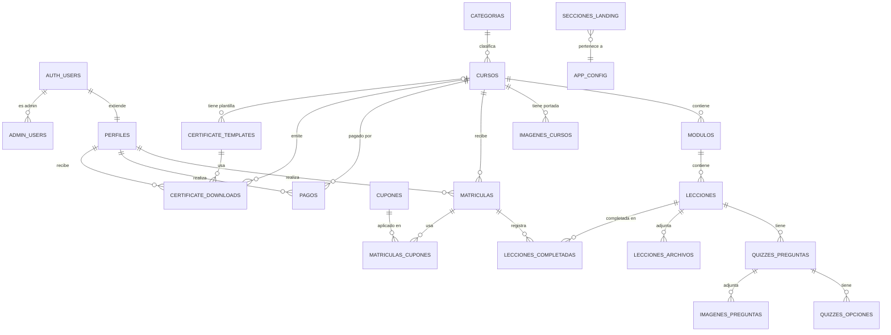

# Diagrama de Relaciones (ER)
**Versión:** 2.0 — Actualizado 2026-03-29

---

## Diagrama completo

---

## Tablas — detalle

### Core LMS

| Tabla | Descripción | Columnas clave |
|-------|-------------|----------------|
| `perfiles` | Datos del usuario (extiende auth.users) | `id` (FK auth.users), `nombre`, `rut`, `email`, `rol` |
| `admin_users` | Registro de usuarios con rol admin | `user_id` (FK auth.users) |
| `cursos` | Catálogo de cursos | `id`, `titulo`, `slug`, `descripcion`, `categoria_id`, `precio`, `tipo_acceso`, `horas`, `activo` |
| `categorias` | Categorías de cursos | `id`, `nombre`, `slug` |
| `modulos` | Agrupación de lecciones | `id`, `curso_id`, `titulo`, `orden` |
| `lecciones` | Unidades de contenido | `id`, `modulo_id`, `titulo`, `tipo` (video/texto/quiz), `orden`, `contenido`, `video_url` |
| `lecciones_archivos` | Archivos adjuntos a lecciones | `id`, `leccion_id`, `nombre`, `url`, `storage_path` |
| `imagenes_cursos` | Portadas de cursos | `id`, `curso_id`, `url`, `storage_path` |

### Evaluaciones

| Tabla | Descripción | Columnas clave |
|-------|-------------|----------------|
| `quizzes_preguntas` | Preguntas de quiz | `id`, `leccion_id`, `texto`, `tipo` (multiple/vf/abierta), `orden` |
| `quizzes_opciones` | Opciones de respuesta | `id`, `pregunta_id`, `texto`, `es_correcta` |
| `imagenes_preguntas` | Imágenes adjuntas a preguntas | `id`, `pregunta_id`, `url`, `storage_path` |

### Matrículas y Progreso

| Tabla | Descripción | Columnas clave |
|-------|-------------|----------------|
| `matriculas` | Inscripción alumno ↔ curso | `id`, `perfil_id`, `curso_id`, `estado`, `progreso_porcentaje`, `created_at` |
| `lecciones_completadas` | Progreso por lección | `id`, `matricula_id`, `leccion_id`, `completada_at` |

### Pagos y Cupones

| Tabla | Descripción | Columnas clave |
|-------|-------------|----------------|
| `cupones` | Códigos de descuento | `id`, `codigo`, `descuento_porcentaje`, `activo`, `usos_maximos`, `usos_actuales` |
| `matriculas_cupones` | Cupones aplicados a matrículas | `id`, `matricula_id`, `cupon_id` |
| `pagos` | Transacciones de pago | `id`, `perfil_id`, `curso_id`, `gateway`, `monto`, `estado`, `token`, `orden_id` |
| `payment_configs` | Credenciales de pasarelas | `id`, `gateway` (transbank/flow/mercadopago), `habilitado`, `modo` (sandbox/produccion), credenciales |

### Certificados

| Tabla | Descripción | Columnas clave |
|-------|-------------|----------------|
| `certificate_templates` | Plantillas visuales de certificados | `id`, `nombre`, `curso_id` (null = global), `orientacion`, `background_storage_path`, `color_primary`, `color_accent`, `pos_*`, `texto_libre`, `activo` |
| `certificate_downloads` | Certificados emitidos (inmutables) | `id`, `perfil_id`, `curso_id`, `template_id`, `storage_path`, `fecha_vigencia`, `version`, `invalidado_at` |

### CMS

| Tabla | Descripción | Columnas clave |
|-------|-------------|----------------|
| `app_config` | Configuración global de la OTEC | `clave` (PK), `valor` (JSON): identidad, colores, contacto, RRSS, SEO |
| `secciones_landing` | Secciones de la home | `tipo` (hero/stats/clientes/testimonios), `contenido` (JSON), `activo` |
| `paginas` | Páginas CMS dinámicas | `id`, `titulo`, `slug`, `contenido_html`, `estado` (publicado/borrador), `seo_*` |
| `media_library` | Biblioteca de medios subidos | `id`, `nombre`, `url`, `storage_path`, `tipo_mime`, `tamano_bytes`, `subida_por` |

---

## Storage Buckets (Supabase)

| Bucket | Uso |
|--------|-----|
| `certificados` | Imágenes de fondo de plantillas (`templates/`) + PDFs emitidos (`pdfs/`) |
| `cursos` | Portadas de cursos, archivos adjuntos a lecciones, imágenes de preguntas |

---

## Notas de integridad

- Los PDFs de certificados emitidos son **inmutables**: se guardan en Storage y se sirven desde ahí. Cambiar una plantilla no afecta certificados ya emitidos.
- `certificate_templates` con `curso_id = NULL` es la plantilla **global** (fallback). Un curso puede tener su propia plantilla específica.
- `lecciones_archivos` y `archivos_lecciones` son el mismo concepto — el código los usa indistintamente. La tabla real en BD es `lecciones_archivos`.
- `admin_users` + `perfiles.rol` coexisten: `requireAdmin()` consulta `admin_users` primero y `perfiles` como fallback.
