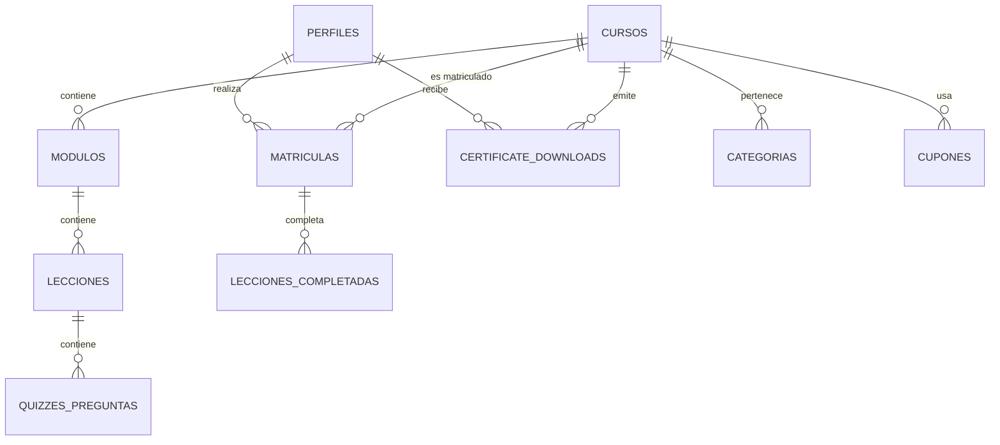

# 📈 Diagrama de Relaciones (ER)

```mermaid
erDiagram
    CURSOS ||--o{ MODULOS : "contiene"
    MODULOS ||--o{ LECCIONES : "contiene"
    CURSOS ||--o{ MATRICULAS : "es matriculado"
    PERFILES ||--o{ MATRICULAS : "realiza"
    MATRICULAS ||--o{ LECCIONES_COMPLETADAS : "completa"
    LECCIONES ||--o{ QUIZZES_PREGUNTAS : "contiene"
    CURSOS ||--o{ CERTIFICATE_DOWNLOADS : "emite"
    PERFILES ||--o{ CERTIFICATE_DOWNLOADS : "recibe"
    CURSOS ||--o{ CATEGORIAS : "pertenece"
    CURSOS ||--o{ CUPONES : "usa"
```

