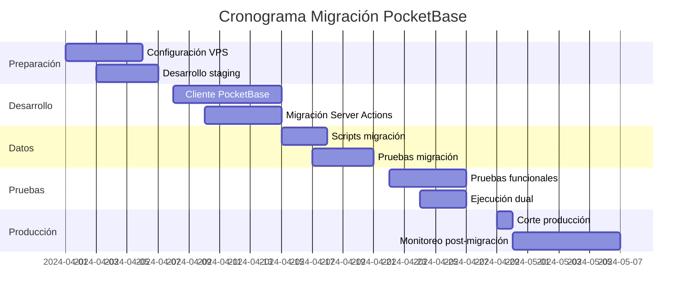

# Plan de Migración a PocketBase en VPS

## 📋 Resumen Ejecutivo

**Objetivo**: Migrar el sistema LMS "Capacitar y Crecer" desde Supabase (SaaS) hacia PocketBase (self-hosted) en un VPS propio, manteniendo funcionalidad completa y sin downtime para usuarios existentes.

**Justificación**:
- **Independencia**: Control total sobre base de datos y archivos
- **Costo predecible**: Eliminación de costos variables de Supabase
- **Personalización**: Capacidad de modificar lógica de negocio en el backend
- **Rendimiento**: Comunicación local entre aplicación y base de datos

**Estado actual**: ✅ Sistema con correcciones de seguridad implementadas (Fase 1 completada)

---

## 🎯 Objetivos Específicos

1. **Migrar datos** desde Supabase (PostgreSQL) a PocketBase (SQLite) sin pérdida
2. **Migrar archivos** desde Supabase Storage a PocketBase Files
3. **Adaptar autenticación** de Supabase Auth a PocketBase Auth
4. **Implementar cliente PocketBase** equivalente a los clientes Supabase existentes
5. **Establecer entorno de producción** en VPS con alta disponibilidad
6. **Garantizar rollback** en caso de problemas durante migración

---

## 🏗️ Arquitectura Objetivo

### **Diagrama de Despliegue**
```
Usuarios → Cloudflare CDN → VPS (Ubuntu 22.04)
                               ├── Nginx (reverse proxy + SSL)
                               ├── Docker Compose
                               │   ├── PocketBase (:8090)
                               │   │   ├── SQLite database
                               │   │   ├── File storage
                               │   │   └── Admin UI
                               │   └── Next.js (:3000)
                               │       ├── App Router
                               │       └── Server Actions
                               └── Backup automatizado (diario)
```

### **Especificaciones VPS Recomendadas**
- **CPU**: 4 vCPU cores
- **RAM**: 8GB mínimo (16GB recomendado para crecimiento)
- **Storage**: 100GB SSD (expandible)
- **OS**: Ubuntu 22.04 LTS
- **Red**: 1Gbps, IP pública estática
- **Costo estimado**: $40-60/mes (Hetzner, DigitalOcean, AWS Lightsail)

---

## 📋 Prerrequisitos

### **1. Acceso y Credenciales**
- [ ] **Acceso SSH** al VPS con privilegios sudo
- [ ] **Credenciales Supabase**:
  - `SUPABASE_URL`
  - `SUPABASE_SERVICE_ROLE_KEY`
- [ ] **Dominio** configurado y apuntando al VPS
- [ ] **Certificado SSL** (Let's Encrypt automático)
- [ ] **Credenciales email** (Resend, Mailgun, etc.)

### **2. Recursos de Desarrollo**
- [ ] **Entorno local** con Docker y Node.js 18+
- [ ] **Copia completa** del repositorio en GitHub
- [ ] **Ambiente staging** para pruebas de migración
- [ ] **Backup completo** de Supabase (datos + storage)

### **3. Tiempo y Personal**
- **Líder técnico**: 1 persona (40 horas)
- **Tester**: 1 persona (20 horas)
- **Ventana de mantenimiento**: 4 horas (fin de semana)
- **Tiempo total estimado**: 3-4 semanas (desarrollo + pruebas + migración)

---

## 📊 Fases de Migración

### **Fase 0: Preparación (Semana 1)**
**Objetivo**: Ambiente listo para desarrollo y pruebas

| Tarea | Descripción | Estado |
|-------|-------------|---------|
| **0.1** | Configurar VPS con `scripts/setup-vps.sh` | 🔄 Pendiente |
| **0.2** | Desplegar PocketBase + Next.js en staging | 🔄 Pendiente |
| **0.3** | Crear scripts de migración de datos | ✅ Completado |
| **0.4** | Documentar mapeo de esquemas | ✅ Completado |
| **0.5** | Establecer monitoreo básico (logs, health checks) | 🔄 Pendiente |

**Entregables**:
- VPS configurado con Docker, Nginx, SSL
- Ambiente staging funcional
- Scripts de migración validados localmente

### **Fase 1: Desarrollo de Cliente PocketBase (Semana 2)**
**Objetivo**: Adaptar código para usar PocketBase en lugar de Supabase

| Tarea | Descripción | Estado |
|-------|-------------|---------|
| **1.1** | Crear `lib/pocketbase-client.ts` (equivalente a `supabase-client.ts`) | 🔄 Pendiente |
| **1.2** | Crear `lib/pocketbase-server.ts` (equivalente a `supabase-server.ts`) | 🔄 Pendiente |
| **1.3** | Crear `lib/pocketbase-admin.ts` (operaciones privilegiadas) | 🔄 Pendiente |
| **1.4** | Adaptar tipos TypeScript para PocketBase | 🔄 Pendiente |
| **1.5** | Migrar Server Actions (1 por 1, validando funcionalidad) | 🔄 Pendiente |
| **1.6** | Implementar autenticación con PocketBase Auth | 🔄 Pendiente |
| **1.7** | Adaptar uploads/downloads de archivos | 🔄 Pendiente |

**Entregables**:
- Clientes PocketBase funcionales
- Autenticación migrada
- Server Actions compatibles con ambos backends

### **Fase 2: Migración de Datos (Semana 3)**
**Objetivo**: Transferir datos de producción desde Supabase a PocketBase

| Tarea | Descripción | Estado |
|-------|-------------|---------|
| **2.1** | Ejecutar backup completo de Supabase | 🔄 Pendiente |
| **2.2** | Exportar datos con `scripts/migrate-to-pocketbase/` | 🔄 Pendiente |
| **2.3** | Transformar esquema (PostgreSQL → SQLite) | 🔄 Pendiente |
| **2.4** | Importar datos a PocketBase staging | 🔄 Pendiente |
| **2.5** | Validar integridad de datos migrados | 🔄 Pendiente |
| **2.6** | Migrar archivos de Storage (imágenes, PDFs, etc.) | 🔄 Pendiente |
| **2.7** | Comparar conteos y relaciones entre sistemas | 🔄 Pendiente |

**Entregables**:
- Base de datos PocketBase con datos de producción
- Archivos migrados a PocketBase Files
- Reporte de validación de integridad

### **Fase 3: Pruebas y Validación (Semana 3-4)**
**Objetivo**: Verificar que el sistema funciona correctamente con PocketBase

| Tarea | Descripción | Estado |
|-------|-------------|---------|
| **3.1** | Pruebas funcionales (usuarios, cursos, pagos, certificados) | 🔄 Pendiente |
| **3.2** | Pruebas de carga (simular usuarios concurrentes) | 🔄 Pendiente |
| **3.3** | Pruebas de seguridad (autenticación, autorización) | 🔄 Pendiente |
| **3.4** | Período de ejecución dual (datos a ambos sistemas) | 🔄 Pendiente |
| **3.5** | Validación con usuarios reales (beta testing) | 🔄 Pendiente |
| **3.6** | Corrección de bugs identificados | 🔄 Pendiente |

**Entregables**:
- Reporte de pruebas con resultados
- Sistema estable en staging
- Lista de bugs corregidos

### **Fase 4: Corte a Producción (Día D)**
**Objetivo**: Cambiar tráfico de producción a nuevo sistema sin downtime

| Tiempo | Tarea | Descripción |
|--------|-------|-------------|
| **D-7** | Comunicar mantenimiento a usuarios | Notificar ventana de mantenimiento |
| **D-1** | Backup final de Supabase | Última copia antes de corte |
| **D-1** | Desplegar última versión en VPS | Docker Compose con PocketBase |
| **D-0 00:00** | Iniciar ventana de mantenimiento | 4 horas asignadas |
| **D-0 00:15** | Migrar datos incrementales (últimos 7 días) | Sincronizar cambios recientes |
| **D-0 01:00** | Validar migración incremental | Verificar datos frescos |
| **D-0 01:30** | Cambiar DNS/load balancer a nuevo VPS | Redirigir tráfico |
| **D-0 02:00** | Monitoreo intensivo (30 minutos) | Verificar que todo funciona |
| **D-0 02:30** | Pruebas rápidas de funcionalidad crítica | Login, cursos, pagos |
| **D-0 03:00** | Comunicar finalización de mantenimiento | Sistema disponible |
| **D-0 04:00** | Monitoreo extendido (primeras 24 horas) | Alerta temprana de problemas |

**Entregables**:
- Sistema en producción con PocketBase
- Monitoreo activo
- Plan de rollback ejecutable si es necesario

### **Fase 5: Post-Migración (Semana 5)**
**Objetivo**: Estabilizar y optimizar sistema en producción

| Tarea | Descripción | Estado |
|-------|-------------|---------|
| **5.1** | Monitoreo de performance y errores | 🔄 Pendiente |
| **5.2** | Optimización basada en métricas reales | 🔄 Pendiente |
| **5.3** | Limpieza de datos temporales de migración | 🔄 Pendiente |
| **5.4** | Documentación actualizada | 🔄 Pendiente |
| **5.5** | Plan de escalabilidad (si es necesario) | 🔄 Pendiente |
| **5.6** | Retención de Supabase por 30 días (solo backup) | 🔄 Pendiente |

**Entregables**:
- Sistema estable y optimizado
- Documentación completa
- Plan de escalabilidad

---

## 🔄 Plan de Rollback

### **Escenario 1: Problemas durante migración (primeras 2 horas)**
**Acción**: Revertir a Supabase
1. Restaurar DNS/load balancer a infraestructura anterior
2. Mantener PocketBase en modo lectura para análisis posterior
3. Investigar causa raíz en ambiente aislado

### **Escenario 2: Problemas críticos post-migración (primeras 24 horas)**
**Acción**: Rollback completo
1. Redirigir tráfico a Supabase (backup D-1)
2. Sincronizar datos modificados en PocketBase hacia Supabase
3. Comunicar a usuarios sobre mantenimiento extendido

### **Escenario 3: Problemas de performance (primeras 72 horas)**
**Acción**: Optimización en caliente
1. Analizar cuellos de botella (SQLite, Nginx, Next.js)
2. Aplicar optimizaciones (indexes, caching, configuraciones)
3. Escalar recursos VPS si es necesario

### **Recursos de Rollback**
- **Backup Supabase**: Retenido por 30 días
- **Snapshot VPS**: Antes de migración
- **Docker images**: Versiones anteriores etiquetadas
- **Database dumps**: Puntos de restauración cada 4 horas durante migración

---

## ⚠️ Riesgos y Mitigaciones

| Riesgo | Probabilidad | Impacto | Mitigación |
|--------|--------------|---------|------------|
| **Pérdida de datos durante migración** | Baja | Alto | Backup completo pre-migración + validación paso a paso |
| **Downtime prolongado** | Media | Alto | Ventana de mantenimiento comunicada + rollback planificado |
| **Problemas de autenticación** | Media | Alto | Período de ejecución dual + migración de sesiones activas |
| **Performance inferior a Supabase** | Baja | Medio | Benchmarking pre-migración + plan de escalabilidad |
| **Errores en lógica de negocio migrada** | Media | Alto | Pruebas exhaustivas + beta testing con usuarios reales |
| **Problemas con archivos migrados** | Baja | Medio | Validación de integridad de archivos + URLs de respaldo |
| **Falta de expertise en PocketBase** | Media | Medio | Documentación + pruebas en staging + comunidad PocketBase |

---

## 📈 Métricas de Éxito

### **Métricas Técnicas**
- **Disponibilidad**: 99.9% post-migración
- **Tiempo de respuesta**: < 200ms para API, < 2s para páginas
- **Tasa de errores**: < 0.1% de requests
- **Uptime**: 0 downtime no planificado en primera semana

### **Métricas de Negocio**
- **Usuarios activos**: Mantener o mejorar números pre-migración
- **Conversión pagos**: Sin impacto negativo
- **Satisfacción usuario**: Sin aumento en tickets de soporte
- **Costo infraestructura**: Reducción del 30-50% vs Supabase

### **Métricas de Calidad**
- **Coverage pruebas**: > 80% de funcionalidad crítica probada
- **Bugs críticos**: 0 en producción post-migración
- **Performance**: Mejora o igual a Supabase en 90% de operaciones

---

## 🛠️ Recursos y Herramientas

### **Scripts Desarrollados**
- [`scripts/setup-vps.sh`](scripts/setup-vps.sh): Configuración automatizada de VPS
- [`docker-compose.pb.yml`](docker-compose.pb.yml): Docker Compose para PocketBase + Next.js
- [`scripts/migrate-to-pocketbase/`](scripts/migrate-to-pocketbase/): Scripts de migración de datos

### **Documentación**
- [README migración](scripts/migrate-to-pocketbase/README.md): Proceso detallado de migración
- [Esquema de datos](scripts/migrate-to-pocketbase/README.md#mapeo-de-esquemas): Mapeo Supabase → PocketBase
- [Consideraciones especiales](scripts/migrate-to-pocketbase/README.md#consideraciones-especiales): Autenticación, Storage, etc.

### **Monitoreo**
- **Application**: Sentry / LogRocket (errores frontend)
- **Infrastructure**: UptimeRobot / Pingdom (disponibilidad)
- **Performance**: Lighthouse / WebPageTest (frontend)
- **Database**: PocketBase logs + SQLite análisis

---

## 📅 Cronograma Estimado



**Duración total**: 4 semanas (20 días hábiles)

---

## 👥 Responsabilidades

| Rol | Responsabilidades | Persona Asignada |
|-----|-------------------|------------------|
| **Líder Técnico** | Planificación, desarrollo cliente PB, migración datos | *Por asignar* |
| **DevOps** | Configuración VPS, Docker, Nginx, SSL, backups | *Por asignar* |
| **QA/Tester** | Pruebas funcionales, carga, seguridad | *Por asignar* |
| **Product Owner** | Comunicación a usuarios, validación negocio | *Por asignar* |
| **Soporte** | Monitoreo post-migración, atención incidencias | *Por asignar* |

---

## 📞 Contactos y Comunicación

### **Comunicación Interna**
- **Canal principal**: Slack/Teams #migracion-pocketbase
- **Reuniones diarias**: Standup 9:30 AM (durante migración)
- **Reportes**: Diario al final del día
- **Decisiones críticas**: Requieren aprobación de líder técnico + product owner

### **Comunicación Externa**
- **Usuarios**: Email 7 días antes, 24 horas antes, post-migración
- **Clientes empresariales**: Contacto directo vía account manager
- **Soporte**: Knowledge base actualizada, FAQ migración

---

## ✅ Checklist de Inicio

### **Antes de Comenzar**
- [ ] VPS provisionado con recursos adecuados
- [ ] Acceso SSH configurado y probado
- [ ] Dominio apuntando a VPS (DNS propagado)
- [ ] Credenciales Supabase disponibles
- [ ] Backup completo de Supabase ejecutado
- [ ] Equipo asignado y capacitado en PocketBase
- [ ] Ventana de mantenimiento acordada con stakeholders
- [ ] Plan de rollback revisado y aprobado

### **Punto de no retorno**
Una vez iniciada la **Fase 2 (Desarrollo de Cliente PocketBase)**, el proyecto debe continuar hasta completar la migración o ejecutar rollback planificado. No hay punto medio sostenible.

---

## 🔗 Referencias

1. [PocketBase Documentation](https://pocketbase.io/docs)
2. [PocketBase JavaScript SDK](https://github.com/pocketbase/js-sdk)
3. [Supabase Migration Guide](https://supabase.com/docs/guides/migrations)
4. [SQLite vs PostgreSQL Comparison](https://www.sqlite.org/whentouse.html)
5. [Docker Compose Reference](https://docs.docker.com/compose/compose-file/)

---

*Última actualización: 2024-03-31*  
*Documento vivo - Actualizar según progreso de migración*